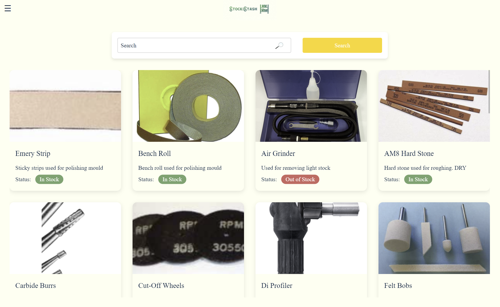

# StockiStash

## Overview

StockiStash is an inventory management application that allows employers and management to keep track of inventory effectively. It provides a clear vision of the storage, making it easier to manage and maintain the inventory.

### Problem

In a production environment, one crucial aspect of maintaining a steady workflow is tracking inventory. This is particularly challenging for small businesses that cannot afford a sophisticated system for storage checking or are unaware of such systems. StockiStash also aids employees by providing a visual representation of items along with their information, facilitating better management and usage.

### User Profile

- **Management:**
  - Check inventory quantity
  - Identify items that are running low
  - Edit and delete items

- **Employees:**
  - Visualize items
  - Take out items
  - Return items
  - Search for items

### Features

- Learn more about items
- Search for items
- Dark mode support
- Create an account
- Login and logout
- Inventory management for managers
- Visual item representation for employees

## Implementation

### Tech Stack

- **Frontend:** React, TailwindCSS
- **Backend:** Express, Knex
- **Database:** MySQL
- **Client Libraries:** 
  - react
  - react-router
  - axios
  - react-toastify
  - react-slick
- **Server Libraries:**
  - knex
  - express
  - fs
  - jsonwebtoken
  - cors
  - dotenv
  - bcrypt
  - mysql2

### APIs

- No external APIs are used in the first sprint.

### Sitemap

- Home page
- Items page
- Item detail page
- Register page
- Login page
- Profile page

### Mockups

#### Home Page

#### Inventory Page

#### Register Page

#### Login Page

#### Employee Page

#### Item Details

#### Edit Item Details

### Data Model

#### User Table
| Column     | Type    | Description         |
|------------|---------|---------------------|
| id         | INT     | Primary key         |
| first_name | VARCHAR | User's first name   |
| last_name  | VARCHAR | User's last name    |
| user_name  | VARCHAR | User's username     |
| password   | VARCHAR | User's password     |
| user_role  | VARCHAR | User's role         |

#### Inventory Table
| Column       | Type    | Description                 |
|--------------|---------|-----------------------------|
| id           | INT     | Primary key                 |
| user_id      | INT     | References User table       |
| item_name    | VARCHAR | Name of the item            |
| description  | TEXT    | Description of the item     |
| quantity     | INT     | Quantity in stock           |
| status       | VARCHAR | Stock status                |
| image        | VARCHAR | Image URL of the item       |
| link         | VARCHAR | Link to buy the item        |

#### Grit Table
| Column      | Type    | Description                    |
|-------------|---------|--------------------------------|
| id          | INT     | Primary key                    |
| inventory_id| INT     | References Inventory table     |
| grit        | VARCHAR | Grit type                      |
| quantity    | INT     | Quantity in stock              |
| description | TEXT    | Description of the grit        |
| image       | VARCHAR | Image URL of the grit          |

#### Cart Table
| Column        | Type    | Description                |
|---------------|---------|----------------------------|
| id            | INT     | Primary key                |
| user_id       | INT     | References User table      |
| inventory_id  | INT     | References Inventory table |
| quantity      | INT     | Quantity in cart           |

### Endpoints

**GET /inventory**

- Returns all inventory items with their information and status.

**GET /inventory/:id**

- Returns a single inventory item with its information.

**POST /inventory**

- Allows a logged-in user to add an item to their account/cart.

**POST /inventory/:id**

- Allows a logged-in manager to add an item to inventory.

**PUT /inventory/:id**

- Allows a logged-in manager to update an item in inventory.

**POST /users/register**

- Adds a user account.

**POST /users/login**

- Logs in a user.

**DELETE /inventory/:id**

- Allows a manager to delete items from inventory.

### Auth

- JWT authentication
  - Store JWT in localStorage, remove when a user logs out.

## Roadmap

- Create client and server projects
- Implement core features
- Deploy client and server
- Feature development:
  - Home page
  - Inventory tracking
  - Item details
  - User account creation
  - User login
  - User profile
  - Implement JWT tokens
- Bug fixes
- DEMO DAY

## Nice-to-haves

- Manager role can see the number of employees
- Dedicated page for tool usage
- Forgot password functionality
- Reporting features

